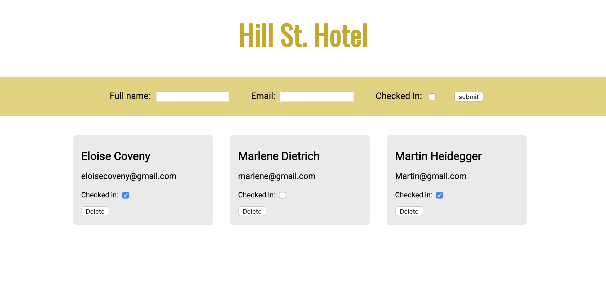

# Hotel Bookings App
**Individual Lab: JavaScript, Vue.js**

## The Brief
The lab brief was to build a full-stack JavaScript Vue application for a hotel administrator to manage hotel bookings; being able to add guests and check them in and out.

[Project Brief](https://github.com/codeclan/g11_classnotes/blob/master/week_08/day_3/lab_hotel_checkins/lab_hotel_checkins.md)

## Screen grabs

-> _user interface_

## Installation Setup

[Client](./client/README.md)

[Server](./server/README.md)
